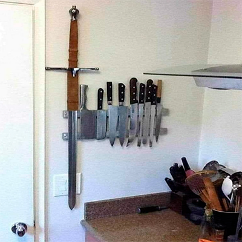

# Landing Page Irracional

O objetivo deste projeto é mostrar os fundamentos básicos de HTML e CSS. No final, você vai aprender a criar uma simples landing page. 

Visualize o projeto final: https://pabloirracional.github.io/landing-page-irracional/


## Requisitos
- VS Code
- Live server
## Início

Crie uma pasta na área de trabalho do seu computador e abra ela dentro do VS Code.

Crie todos os arquivos necessários dentro da pasta. 


## Estrutura básica HTML

Agora, vamos ganhar tempo! No VS Code, a gente digita '!' e aperta 'Enter'. Mágica! E ele cria a estrutura básica do HTML pra gente. 


Agora, vamos quebrar cada uma dessas tags e entender para que serve:

<!DOCTYPE html>

Esta declaração informa ao navegador que o documento está usando HTML5, que é a versão mais recente do HTML. Não é tecnicamente uma "tag", mas sim uma instrução para o navegador.

Explicando HTML5 e HTML semântico - 

A versão que estamos usando é o HTML5, que trouxe uma parada chamada HTML semântico. Em vez de usar só divs pra tudo, agora temos tags como 'header', 'section', 'footer', que deixam o código mais legível e organizado. Tipo separar a pizza por sabor!

### `<html>`
Esta é a tag raiz que envolve todo o conteúdo da página HTML. Tudo que estiver dentro dessa tag será parte da estrutura do documento HTML.

- **Atributo `lang="pt-BR"`**: Define o idioma da página como português brasileiro, o que é importante para SEO (otimização para motores de busca) e acessibilidade.

### `<head>`
A tag `<head>` contém metadados sobre a página. Esses metadados não aparecem no corpo do documento, mas são essenciais para definir o comportamento da página e fornecer informações aos navegadores e motores de busca.

### `<meta charset="UTF-8">`
Esta tag define o conjunto de caracteres usados no documento. O `UTF-8` é o padrão que permite o uso de praticamente todos os caracteres e símbolos de diferentes idiomas. Isso garante que os textos acentuados ou símbolos especiais sejam exibidos corretamente.

### `<meta name="viewport" content="width=device-width, initial-scale=1.0">`
Esta tag garante que a página seja exibida corretamente em dispositivos móveis, ajustando a largura da página ao tamanho da tela. Isso é crucial para tornar a página responsiva.

### `<title>`
A tag `<title>` define o título da página que aparece na aba do navegador ou quando a página é favoritada. Ela também é usada por mecanismos de busca para mostrar o título nos resultados de pesquisa.

### `<body>`
Aqui dentro vai o conteúdo visível da página, ou seja, o que será exibido para o usuário. Tudo o que você deseja que apareça no site precisa estar dentro dessa tag.


### `ID/Class` 

O ID é único e serve para identificar um elemento específico. Já a 'class' é usada para agrupar elementos que compartilham o mesmo estilo. É com esses atributos que estilizamos e identificamos cada uma de nossas tags. 

## Explicação das tags do projeto.

### Seção "Home" (Boas-vindas)

```html
<section id="home-page">
  <div class="container">
    <div id="main-header-div">
      <header id="main-header">
        <h1>Seja Irracional, seja você!</h1>
        <p>Bem-vindo à Irracional Store...</p>
        <a href="#gallery-page">
          <button class="home-btn">Explorar Produtos</button>
        </a>
      </header>

      
    </div>
  </div>
</section>
```
- **`<section id="home-page">`**: Define a seção de boas-vindas da página, com um `id` que facilita a navegação interna.
- **`<div class="container">`**: Um contêiner que centraliza o conteúdo para melhor organização.
- **`<header id="main-header">`**: Define o cabeçalho da seção, com título e introdução.
- **`<h1>`**: Título principal, aqui com o slogan "Seja Irracional, seja você!".
- **`<p>`**: Um parágrafo com uma breve descrição da loja.
- **`<a href="#gallery-page">`**: Um link para a próxima seção, a galeria de produtos.
- **`<button class="home-btn">`**: Um botão para explorar produtos, estilizado com a classe `home-btn`.
- **``**: Imagem de um personagem, com um texto alternativo (`alt`) para acessibilidade.

### Galeria de Produtos

```html
<section id="gallery-page">
  <div class="container">
    <header id="header-products">
      <h2>Melhores Produtos</h2>
      <p>Confira os produtos mais vendidos!</p>
    </header>
    <div class="gallery">
      <div class="product-card">
        
        <h3>Talheres</h3>
        <p>Talheres Inquebráveis...</p>
        <p class="price">R$ 299</p>
      </div>
      <!-- Repetição para os demais produtos -->
    </div>
    <p class="cta">
      Interessado em nossos produtos? Saiba mais abaixo ou nos envie uma
      <a href="#contact-page">mensagem</a>.
    </p>
  </div>
</section>
```
- **`<section id="gallery-page">`**: Define a seção para exibir os produtos da loja.
- **`<header id="header-products">`**: Cabeçalho da galeria com título e breve descrição.
- **`<h2>`**: Título de segundo nível, para a seção de produtos.
- **`<div class="gallery">`**: Contêiner que agrupa os cartões de produtos.
- **`<div class="product-card">`**: Cartão de cada produto, contendo imagem, título, descrição e preço.
- **`<p class="price">`**: Parágrafo com a classe `price`, destacando o preço do produto.
- **`<p class="cta">`**: Texto com chamada para ação, incentivando a explorar a página de contato.

### Seção de Avaliações (Reviews)

```html
<section id="reviews-section">
  <div class="container">
    <header id="header-reviews">
      <h2>Avaliações</h2>
      <p>Veja o que nossos clientes têm a dizer!</p>
    </header>
    <div class="gallery-reviews">
      <div class="card">
        
        <h3>Fulano</h3>
        <p>⭐⭐⭐⭐</p>
        <p>Os talheres são realmente inquebráveis...</p>
      </div>
      <!-- Repetição para os demais clientes -->
    </div>
  </div>
</section>
```
- **`<section id="reviews-section">`**: Seção de avaliações de clientes.
- **`<header id="header-reviews">`**: Cabeçalho da seção com título e descrição.
- **`<div class="gallery-reviews">`**: Contêiner que agrupa as avaliações em formato de cartão.
- **`<div class="card">`**: Cartão de cada cliente com imagem, nome, avaliação e comentários.

### Formulário de Contato

```html
<section id="contact-page">
  <header id="small-header">
    <h2>Entre em contato</h2>
  </header>
  <div class="container-small">
    <form action="" method="post">
      <div>
        <label for="contact-name">Nome</label>
        <input type="text" name="contact-name" id="contact-name" />
      </div>
      <div>
        <label for="contact-email">Email</label>
        <input type="email" name="contact-email" id="contact-email" />
      </div>
      <div>
        <label for="contact-message">Mensagem</label>
        <textarea name="contact-message" id="contact-message" cols="30" rows="10"></textarea>
      </div>
      <div id="send-message">
        <button class="btn">Enviar Mensagem</button>
        <p class="muted"><em>Todos os campos precisam ser preenchidos.</em></p>
      </div>
    </form>
  </div>
</section>
```
- **`<section id="contact-page">`**: Seção de formulário de contato.
- **`<header id="small-header">`**: Cabeçalho da seção com título "Entre em contato".
- **`<form action="" method="post">`**: Formulário de contato. `action=""` indica que os dados não serão enviados a um servidor, pois o valor está vazio.
- **`<label>`**: Etiquetas para cada campo do formulário.
- **`<input type="text">`** e **`<input type="email">`**: Campos de entrada para nome e e-mail.
- **`<textarea>`**: Campo de entrada para mensagens mais longas.
- **`<button class="btn">`**: Botão para enviar a mensagem.
- **`<p class="muted">`**: Nota informando que todos os campos devem ser preenchidos.

### Rodapé (Footer)

```html
<footer>
  <p>&copy Irracional Store 2024. Todos os direitos reservados.</p>
</footer>
```
- **`<footer>`**: Seção final da página, com os direitos autorais do site.

